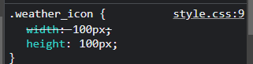
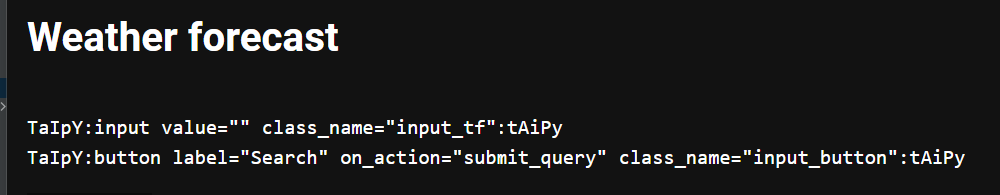

# Compilation of issues found


# Visual issues

### Icon size and css

(Note: I'm not a css/html expert)

I had an icon like:
```commandline
<|{weather_icons}|image|width=100px|height=100px|>
```
Then I switch to use css. So I changed the spec to:
```commandline
<|{weather_icons}|image|class_name=wicon|>
```
and in my css:
```commandline
.wicon {
    width: 100px;
    height: 100px;
}
```
The element is generated as:
```commandline
<button class="MuiButtonBase-root taipy-image weather_icon css-10hatyx"
        tabindex="0" type="button" aria-label=""
        style="width: 300px;">
    <span class="css-vs27xc" style="background-image: url(&quot;https://assets.weatherstack.com/images/wsymbols01_png_64/wsymbol_0002_sunny_intervals.png&quot;);"></span>
    <span class="MuiImageBackdrop-root css-1p4evgx"></span>
    <span class="MuiTouchRipple-root css-w0pj6f">
    </span>
</button>
```
Chrome's inspector says:



Is there anyway of generating icons without width hardcoded ?

### Cannot use html escape

I'm playing around creating a weather app. I wanted to insert the &deg; character.
In standard md/html, this is expected to be `&deg;` - I tried this:

```commandline
age = """
<|part|
[... snip ...]
<|{str(forecast["current"]["temperature"])+"&deg;C" if forecast else ""}|label|>
|>
"""
```
But this produced this output html element:
```commandline
<span class="MuiTypography-root MuiTypography-body1 taipy-text css-9l3uo3" aria-label="">16&amp;deg;C</span>
```
I understand why the `&` was escaped, but the documentation says taipy uses markdown :)

Would it be possible to have a `no_escape` mode ?

### Indentation in pages

I have a page defined as:
```commandline
<|part|
<|layout|
  <|{city}|input|class_name=input_tf|>
  <|Search|button|on_action=submit_query|class_name=input_button|>
|>
<|layout|columns=1fr|
  <|{str(forecast["current"]["temperature"])+"°C" if forecast else ""}|label|class_name=weather_temp|>
  <|{weather_icons}|image|width=100px|height=100px|class_name=weather_icon|>
|>
|>
```
This works. Now I change the indentation:
```commandline
page = """
# Weather forecast
<|part|
  <|layout|
    <|{city}|input|class_name=input_tf|>
    <|Search|button|on_action=submit_query|class_name=input_button|>
  |>
  <|layout|columns=1fr|
    <|{str(forecast["current"]["temperature"])+"°C" if forecast else ""}|label|class_name=weather_temp|>
    <|{weather_icons}|image|width=100px|height=100px|class_name=weather_icon|>
  |>
|>
"""
```
(indentation is 2 spaces every where)

I got that pretty cryptic error:
```commandline
An Error occurred: SyntaxError: Expecting Unicode escape sequence \uXXXX (4:155)
```

Played around with like 4 spaces indent:
```commandline
page = """
# Weather forecast
<|part|
<|layout|
    <|{city}|input|class_name=input_tf|>
    <|Search|button|on_action=submit_query|class_name=input_button|>
|>
...
```
This produced that result:


# Questions

### `on_action` for a text field ?

My UI consist of an input text field and a search button.
Currently, the weather is queried uppon clicking the button.
This behavior is completely OK on a handheld device. However on a
desktop computer, I feel like I'd like to just input some text
and press `ENTER`.

Using `on_change` is one solution. However, my API to query weather has
some requests limits, so I don't want to query on every new character input.

Is there any way to trigger an action on `ENTER` key press when in a TF?


### missing requirements.txt ?

Not a big deal, but:
It would really help developers who want to get involved if one
could just `git clone` the projects, then `pip install -r requirements.txt`.
Pipenv has his uses, but some people like me insist on using conda envs.

### missing instructions for non JS developers

`taipy-gui/setup.py` does this:
```
cd gui && npm ci && npm run build
```
Maybe documentation can be improved for non JS developers
